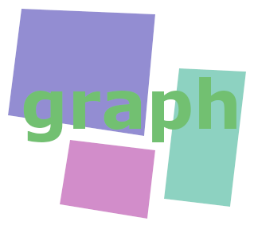

# <b> chaosgraph v2.0 </b>
 

 

# <b> Instroduction </b>
This library contribute to make chart on AWT/Swing/SWT components.
It can be used for AWT/Swing application and Eclipse SWT(Standard Widget Tookit) application also if you would try to build a service of RAP dashboard web application, This library will provide great UX experience and excellent interactive functionality to the service for users.  
 

## Current library download
[chaosgraph-2.0.0.jar](https://github.com/9ins/chaosgraph/raw/master/build/libs/chaosgraph-2.0.0.jar) - Oct 26, 2020
 
 

## <b> What do you make with this? </b>
You could need to make chart based application on pure java GUI, Use this library. Also when you need to build dashboard on non-web-based java application, Just use this. Maybe when if you are working with Eclipse RCP to make analysis app or CRM, MIS, This library could successful choice for your project's goal as UX to users. This library's core is java. Nevertheless, if you use Eclipse RAP, you can make a chart on Web Browser and graphic widget by using this library.  
To use this library, see wiki pages. see above menu.
 

## <b>What is changed and improved?</b>
There is 5 type of chart be supported in this v2.0.0 version.  
Area/Bar/BarRatio/Circle/line chart is currently supported for public user.
This version of the artifacts is quit changed then old version 1.x that was not suppoted interactive event, just only show chart shapes and handling mutil-dimension array to easily cause error.  
Currently 2.0.0 version is providing more object-oriented, more interactive and more good-looked graphical methods and functions.
   

## <b> Specification of additionals and improved</b>
### <b> Additional functionality </b>
* Adding BarRatioGraph  
* SWT(Native Widget) rendering object is provided now in constrast old version. therefore the current version can be used to SWT, Eclipse appplications and RAP web applications.  
* To add function that showing popup windows in chart if When graph be selected by mouse pointer.  
* adding function that a graph be selected when if user select the label of chart element on label placed.
* Whenever user click mouse right or left button, to toggle chart element to circulate clockwise or counter-clokwise
* To spin mouse wheel, to resize chart
* Because chart(Graph) object can be added event listener, Chart engineer can develop for more interactive service to users.
* Adding chart and label border effect. e.g. Showing line or dot style, transpart contrast background on label.
* Adding GraphPanel class that a chart would be drawn in AWT/Swing area.
* Adding GraphCanvas class that a chart would be drawn in SWT/Eclipse area.
### <b> Improved functionality </b>
* Improving that the chart's abstractness and object-oriented concept is to be more resonable and more efficent.
* To make chart's graphical effiect more beautiful.
* When the chart's size to be resize, To make chart's inner element to resize at same ratio.
* Improving chart drawing/Rendering structure.

 
 

## <b>Structure of chart objects</b>

 
 

## <b>Example snippet</b>
This project contains 3 example of the library.  

 

> ### AWTGraphSimple1.java
> This example is chart viewer. 
> To select the chart be wanted, then draw the chart on window.  
> You can output chart image to file with specific image format. e.g. PNG, JPG, TIFF, BMP  
> Location : [PROJECT-PATH]/src/main/java/org/chaostocosmos/chaosgraph/awt2d/AWTGraphSimple1.java  

 

> ### AWTGraphSimple2.java
> This example is JVM memory monitor.  This show that current memory useage of this application on real-time.  
> You can see memory status with some chart types. Also as pushing 'populate object' button, you will see more dynamic progress of memory status.  
> Location : [PROJECT-PATH]/src/main/java/org/chaostocosmos/chaosgraph/awt2d/AWTGraphSimple2.java  

 

> ### SWTGraphSimple.java
> This example is converting SWT version of AWTGraphSimple1 above.  
> Location : [PROJECT-PATH]/src/main/java/org/chaostocosmos/chaosgraph/swt2d/SWTGraphSimple.java

 
 

## <b> Image of Chart </b>

## Area graph for AWT/Swing

 

## Bar graph for AWT/Swing

 

## Bar ratio graph for AWT/Swing

 

## Circle graph for AWT/Swing

 

## Line graph for AWT/Swing

 

## JVM Memory viewer(Movie)
[JVM_Memory_Viewer.mp4](./pic/JVM_Memory_Viewer.mp4)  

 

## How to be expressed your thinking to this project

If you have any problem when you were using, or encountered to be met something to improve on TCPProxy, Please let us know using Issue tab.  
Also If you want to join contributing TCPProxy, you just write and send your profile on Issue tab which title is as "Contribution application", So then we will reply result of qualification of contribution through Issue board.

