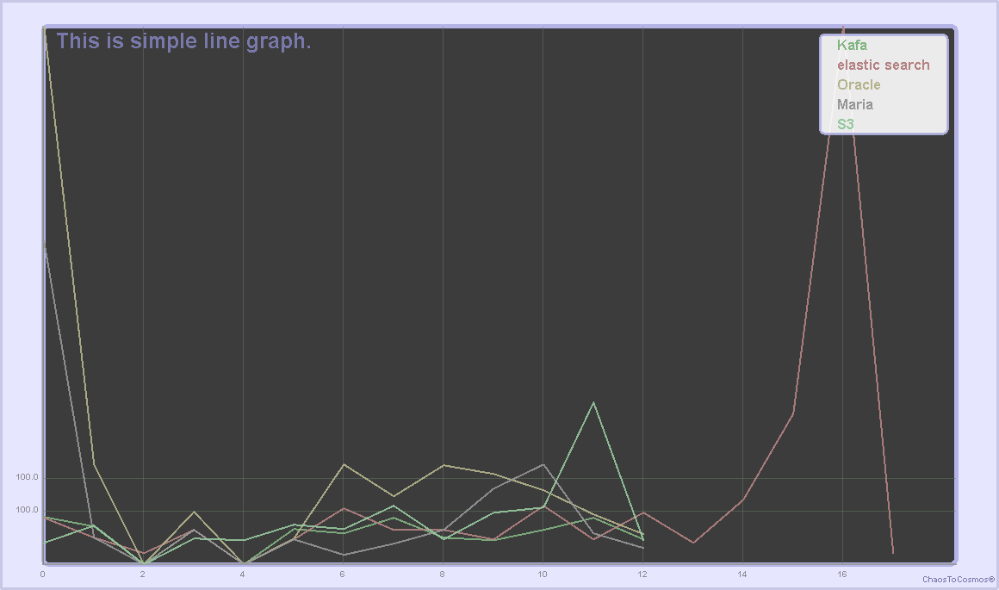

# chaosgraph v2.0
This library contribute to make chart on AWT/SWT components.

## Area graph for AWT/Swing
 { width=50% }

## Bar graph for AWT/Swing
{ width=50% }

## Bar ratio graph for AWT/Swing
{ width=50% }

## Circle graph for AWT/Swing
{ width=50% }

## Line graph for AWT/Swing
{ width=50% }

## JVM Memory viewer(Movie)
  